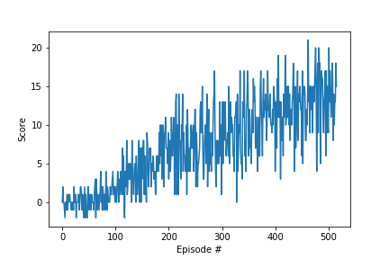

# Navigation
### Summary
In this project, an agent is trained to navigate in a large square world and collect yellow bananas and avoid blue bananas.

A reward of +1 is provided for collecting a yellow banana, and a reward of -1 is provided for collecting a blue banana. The goal was to get an average score of +13 over 100 consecutive episodes.

The state space has 37 dimensions and contains the agent's velocity, along with ray-based perception of objects around the agent's forward direction. Four discrete actions are available: move forward, move backward, turn left, turn right.

Install the following packages using pip:
```
tensorflow==1.7.1
Pillow>=4.2.1
matplotlib
numpy>=1.11.0
jupyter==1.0.0
pytest>=3.2.2
docopt==0.6.2
pyyaml
protobuf==3.5.2
grpcio==1.11.0
torch==0.4.0
pandas==0.23.1
scipy==1.2.0
ipykernel==4.10.0
```
Then download the environment from one of the following links:

Linux: [click here](https://s3-us-west-1.amazonaws.com/udacity-drlnd/P1/Banana/Banana_Linux.zip)
    
Mac OSX: [click here](https://s3-us-west-1.amazonaws.com/udacity-drlnd/P1/Banana/Banana.app.zip)
    
Windows (32-bit): [click here](https://s3-us-west-1.amazonaws.com/udacity-drlnd/P1/Banana/Banana_Windows_x86.zip)
    
Windows (64-bit): [click here](https://s3-us-west-1.amazonaws.com/udacity-drlnd/P1/Banana/Banana_Windows_x86_64.zip)

Then run third cell to import the necessary packages, fourth cell to create an agent and an environment, fifth cell to train the agent and sixth cell to test the agent. 

### Implementation
The agent is initialised in dqn_agent.py with state and action size. Primary and target Q networks with same architecture are created to disentangle TD target from action value function (defined in model.py).

The neural network consists of three hidden layers and all three layers have a ReLU activation function. The network takes 37 states as inputs and outputs the action value function for every possible action in the given state.

### Training
The agent chooses an action based on current state using &epsilon;-greedy algorithm then the environment returns next state and reward. The agent saves the observed experience in replay memory and takes the next step based on the information received. Once the agent has enough samples available in memory, it gets a random subset and starts to learn from that batch using gradient descent.

The agent solves the problem in 416 episodes. The received rewards after each episode can be seen below.



### Parameters used to achieve this result:
| parameter | value |
| --- | --- |
| eps_start | 1 |
| eps_end | 0.1 |
| eps_decay | 0.995 |
| batch size | 64 |
| &gamma; | 0.99 |
| &tau; | 0.002 |
| learning rate | 0.001 |
| buffer size | 100000 |

The parameters eps_start, eps_end and eps_decay are parameters corresponding to probability of choosing whether to explore or exploit in &epsilon;-greedy algorithm. &gamma; is discount factor in Bellman equation. &tau; is for soft update of target parameters. Buffer size is the size of replay buffer while batch size is the size of sampled minibatch of replay buffer. The model's weights is in checkpoint.pth.

### Ideas for future work
Usage of rainbow DQN and hyperparameters optimizer such as optuna might improve performance.